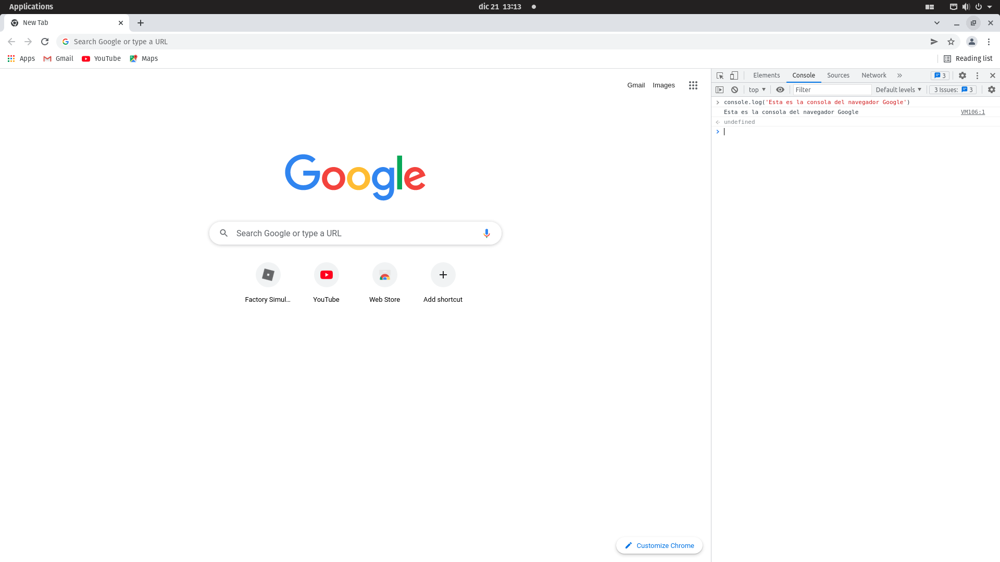

# Curso basico de JavaScript

## Temario

```
1.-Nombres en JavaScript
    camelCase
    PascalCase

2.-Tipos de datos
    String
    Numeros
    Array
    Boleanos

3.-Variables
    Declaración e inicializacion
    Var
    Let
    Const

4.-Imprimir datos
    console
    alert
    prompt
    document.write

5.-Operadores matematicos y aritmeticos
    Adicion
    Sustraccion
    Division
    Residuo
    Multiplicacion
    Exponenciación 
    Incremento 
    Decremento 

6.-Operadores Logicos
    o, or
    y, and
    no, not

7.-Operadores de comparacion
    ==
    ===
    !==
    !===
    >
    <

8.-Operadores de asignacion
    =
    +=
    -=
    *=
    /=
    %=

9.-Condicionales
    if
    else
    else if
```

## Nombres en JavaScript
---
camelCase es una forma de escribir en la que la primera letra de cada palabra de una palabra compuesta por 2 o mas palabras se escribe con mayúscula, excepto la primera palabra de esta.

camelCase es útil en programación ya que los nombres de los elementos
no pueden con,m tener espacios. La forma de escribir de camelCase
hace que los nombres compuestos sean más legibles. Por ejemplo, myOneMethod
es más fácil de leer que myonemethod.

PascalCase es lo mismo que camelCase, pero todas las primeras palabras se escribe con mayúscula.
```
Ejemplo camelCases:
    helloWorld
    nombreApellido
```
```
Ejemplo PascalCase:
    HelloWorld
    NombreApellido
```
## Tipos de datos

Hay varios tipos de datos en JavaScript, algunos son mas dificiles de enteder que otros, pero luego
de que los entiendes no se te olvidan.

### Strings
---
Primero estan los `Strings` que son los mas comunes, es el texto que escribes entre comillas, pueden ser comillas simples(''), dobles("") o backticks (``). Hay algo curioso con los strings en JavaScript, y es que si pones `'55'` eso es un string, pero si pones `55` es un número.

Hablemos sobre la diferencia entre '' y "" son lo mismo, solo que ya se dejaron de ocupar las comillas dobles y en la actualidad se usan las comillas simples.

### Numeros
---
Los números son los que se escriben sin comillas, pueden ser enteros`55`, decimales `55.5` o fraccionrd `55/10`. no se pueden escribir números con comas, pero si se pueden escribir números con punto.

### Arrays
---
Es una forma de almacenar varios valores en una sola variable, es decir, una lista de valores. Los arrays se escriben con corchetes. Puedes almacenar cualquier tipo de datos. Cada tipo de dato tiene su propio espacio y indice. lo raro es que los indices empiezan en 0, no en 1. entonces; Si tienes `['hola', 12, 'Manzana']` el primer valor es `hola`, el segundo es `12` y el tercero es `Manzana`. pero esto no quiere decir que `hola` tenga el indice 1, si no que el indice es 0. Por lo tanto si quieres acceder a este valor, deber hacerlo con `[0]`, Esto es algo complicado y lo hiras entendiendo y ocupando con el tiempo.

```js
| (index) |  Values   |
-----------------------
|    0    |  'hola'   |
|    1    |    12     |
|    2    | 'Manzana' |
```

### Boleanos
---
Verdadero o falso, true or false, es un tipo de dato que es basante peculiar, pero es bastante facil de enteder... hasta que te aparecne cosas como `false == '0'` da true y `false === 0` da false. Cosas de javascript que veremos mas adelante.

## Variables

Si no sabes que es una variable, esta bien, yo te explico. Una variable es un contendedor de información, es decir, un espacio en memoria donde podemos almacenar información. Imaginatelo como una caja, una caja de zapatos, donde puedes almazanar 1 par de zapatos, entonces tu variable seria.
```js
var miCajaDeZapatos = '2 zapatos';
```
Estas **'Variables'** se ocupan cuando tienes por ejemplo usuarios, y cada usuario tiene un nombre, una edad, una dirección, etc. no vas a escribir el nombre del usuario cada vez que lo necesites, sino que vas a poner una variable que contenga el nombre del usuario, entonces cuando lo necesites pones el nombre de la variable. Asi es mucho mas corto y mas facil de entender.
### Sintaxis
---
```js
let nombre = 'valor'; // Se puede cambiar por cualquier tipo de dato
           ^
 Operador de Asignacion
```
### Declaración e inicializacion
---
Estos son solo conceptos que debes aprender, no es la cosa mas importante del mundo, pero es cultura de Js.

```js
var edad; // Declarar una variable
edad = 30; // Inicializar una variable
```
### Diferencias entre var y let
---
```js
var a = 5; // var es mala practica
var b = 10;

{ // bloque de codigo
    let a = 4;
    var b = 1;
    console.log(a) // 4
    console.log(b) // 1
} // Fin del bloque

console.log(a) // 5
console.log(b) // 1

// Con let la variable solo se reescribe dentro del bloque
// Con var se reescribe de forma global
var // No ocupar
let // Si ocupar
```

### Const
---

Si quieres reescribir el valor de una constante no la uses, mejor usa `let`.
```js
const SALUDO = 'hola' // Nombre en MAYUS para identificar la const (Buena Practica)

SALUDO = 1 // Como es una constante no se puede redeclarar su valor (Error)

{ // Este es otro bloque de codigo.
    const SALUDO = 'adios' // Mala practica porque reescribes el valor, pero no da error
    console.log(SALUDO)
}

console.log(SALUDO) // imprimiendo el valor
```

## Imprimir datos
### Consola
---
El console es una herramienta que te permite imprimir datos en la consola de tu navegador. La consola en chrome es esta:

<div align="center">

</div>

Esta seccion se abre con el boton derecho del mouse, y seleccionas `inspect element` o con el shortcut `Ctrl + Shift + i`.

Ya ahora sabiendo como ver la, te preguntaras para que sirve y como se ocupa, tiene varias opciones, pero la que mas se ocupa es la de `console.log`. Veamos un ejemplo con Javascript

```js
console.log('Texto de muestra');     | 'Texto de muestra'
console.log('Izquierda codigo JS');  | 'Izquierda codigo JS'
console.log('Derecha consola');      | 'Derecha consola'
```

Ademas de `console.log` hay otros console, como `console.error` que destaca errores, `console.warn` que te avisa de cosas que pueden ser peligrosas, `console.clear` que limpia la consola, `console.table` que te permite imprimir una tabla con datos, `console.time` y `console.timeEnd` que te permite medir el tiempo que tarda una funcion en ejecutarse, entre otras mas. Todas estas tienen la misma sintaxis solo cambia el `log` por otra cosa.